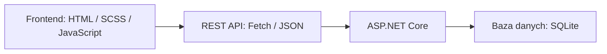

# Fitness Platform

[](https://github.com/beerck7/fitness-platform-web/actions/workflows/ci.yml)

[Otwórz demo](https://beerck7.github.io/fitness-platform-web/)

## O aplikacji

Fitness Platform, czyli **Siłownik**, to aplikacja do planowania treningów, prowadzenia dziennika żywienia i śledzenia postępów. Ma jasny interfejs, fioletowe akcenty i font Outfit. Interfejs jest po polsku.

Frontend korzysta z HTML, SCSS i modułów JavaScript. Backend ASP.NET Core zapisuje dane kont w SQLite. Publiczna strona na GitHub Pages jest demonstracją działającą w przeglądarce; rzeczywiste API można uruchomić lokalnie według instrukcji poniżej.

## Funkcje

- Pulpit z dzisiejszym treningiem, kaloriami, makroskładnikami, wagą, planem tygodnia i szybkimi akcjami.
- Osobne zakładki: Pulpit, Treningi, Ćwiczenia, Kalorie, Znajomi, Profil i Plany, a także Harmonogram i Moje postępy.
- Planowanie ćwiczeń, serii, powtórzeń, docelowych ciężarów i przerw.
- Przeciąganie ćwiczeń z biblioteki do planu, zmiana kolejności i indywidualnych ustawień, szacowany czas treningu oraz podsumowanie grup mięśniowych.
- Kalendarz tygodniowy: przeciąganie planu na dzień i godzinę, zapis, edycja i usuwanie zaplanowanego treningu.
- Lista ćwiczeń do odznaczania podczas sesji, oznaczanie ukończenia, ulubione treningi, zmiana nazwy i usuwanie.
- Wyszukiwanie i dodawanie ćwiczeń w bibliotece.
- Dziennik żywienia z porcjami, kaloriami, makroskładnikami i podziałem na dni oraz posiłki.
- Przeciąganie produktów do posiłków, przenoszenie wpisów i edycja porcji. Te same działania są dostępne przez przyciski na telefonie i z klawiatury.
- Pomiary masy ciała, wykresy i tygodniowe, miesięczne oraz roczne podsumowania treningów.
- Edycja profilu, rejestracja, logowanie i zmiana hasła w trybie API.
- Znajomi: wyszukiwanie publicznych profili, wysyłanie, akceptowanie, odrzucanie i anulowanie zaproszeń.
- Stany ładowania, braku danych i błędu z możliwością ponowienia żądania.

Docelowy ciężar jest wartością planowaną. Lista podczas sesji zapisuje ukończenie treningu; nie rejestruje rzeczywistych wyników każdej serii ani czasu wykonania.

## Jak korzystać

1. Otwórz demo albo uruchom API i zarejestruj konto.
2. Sprawdź panel i wybierz dzień treningu lub przeciągnij istniejący plan do kalendarza tygodniowego.
3. Otwórz **Treningi** i ułóż trening, przeciągając ćwiczenia z biblioteki lub naciskając +. Ustaw powtórzenia, serie, przerwy i docelowy ciężar każdego ćwiczenia. Wartość 0 kg oznacza brak dodatkowego obciążenia. Zapisane treningi znajdziesz w zakładce **Plany**.
4. Otwórz trening, odznacz wykonane ćwiczenia i zakończ sesję.
5. Przeciągnij produkt do posiłku i podaj ilość lub dodaj go przyciskiem. W razie potrzeby przenieś albo edytuj wpisy w dzienniku i zapisz pomiar masy ciała.
6. Sprawdź postępy i dostosuj cele w profilu.

## Technologie

| Obszar                       | Narzędzia                                                     |
| ---------------------------- | ------------------------------------------------------------- |
| Frontend                     | HTML5, SCSS, Vanilla JavaScript ES modules, Fetch API         |
| Style                        | BEM, CSS Grid/Flexbox, zapytania media zgodnie z mobile-first |
| Budowanie i sprawdzanie kodu | Vite, ESLint, Prettier                                        |
| Backend                      | ASP.NET Core / .NET 10, MediatR, EF Core                      |
| Dane i uwierzytelnianie      | SQLite, JWT bearer authentication, BCrypt.Net                 |
| Testy                        | Node test runner, Playwright Chromium, axe-core               |
| Publikacja demo              | GitHub Pages i GitHub Actions                                 |

## Organizacja frontendu



`main.js` obsługuje trasy oparte na fragmencie adresu po `#`. Każda funkcja aplikacji ma mały moduł odpowiadający za widok i interakcje. Klient API obsługuje JSON, tokeny i błędy, a serwisy przypisują działania do endpointów. Zmiana widoku anuluje oczekujące żądania przez `AbortController`.

```text
frontend/src/js/
  api/       # Klient Fetch, serwisy i obsługa demo
  config/    # Adres API i ustawienie trybu demo
  modules/   # Widoki, nawigacja i okna dialogowe
  utils/     # Daty, obliczenia i funkcje pomocnicze DOM
frontend/src/styles/
  abstracts/ # Zmienne i mixiny dla progów szerokości
  base/      # Typografia, reset i style fokusu
  components/
  layout/
  pages/
backend/     # API, logika aplikacji, domena i repozytoria EF
tests/       # Testy jednostkowe i integracyjne przeglądarki oraz API
```

Style opierają się na jasnych kartach, bocznym menu na komputerze i dolnej nawigacji na telefonie. Zdjęcia mają format WebP i są dołączone lokalnie. Fonty zawierają polskie znaki i licencję. Natywne formularze i okna dialogowe obsługują etykiety, walidację i klawiaturę. Tekst dynamiczny jest zabezpieczany przed interpretacją jako HTML.

Kreator w zakładce Treningi i okno tworzenia planu korzystają z tego samego modułu. Pulpit liczy podsumowania z zapisanych treningów, posiłków, celów i pomiarów. Szybkie akcje otwierają istniejące formularze, a wyszukiwarka w górnym pasku przenosi do przefiltrowanej biblioteki ćwiczeń.

## Integracja z REST API

`api/services.js` korzysta ze wspólnego klienta Fetch. `VITE_API_BASE_URL` określa adres bazowy. Podczas pracy lokalnej Vite przekazuje żądania `/api` do `http://127.0.0.1:5080`.

| Metoda        | Endpoint                                      | Zastosowanie                                 |
| ------------- | --------------------------------------------- | -------------------------------------------- |
| POST          | `/api/Account/register`, `/api/Account/login` | Rejestracja i logowanie                      |
| PUT           | `/api/Account/change-password`                | Zmiana hasła                                 |
| GET / PUT     | `/api/User/me`, `/api/me/goal`                | Profil i cele                                |
| GET / POST    | `/api/Workouts`                               | Lista treningów i tworzenie treningu         |
| PUT           | `/api/Workouts/{id}/settings`                 | Zmiana nazwy                                 |
| PATCH         | `/api/Workouts/{id}/completion`               | Zapis ukończenia                             |
| PATCH         | `/api/Workouts/{id}/schedule`                 | Edycja daty, godziny, nazwy i czasu treningu |
| POST          | `/api/Workouts/{id}/toggle-favorite`          | Zmiana statusu ulubionego                    |
| DELETE        | `/api/Workouts/{id}`                          | Usuwanie treningu                            |
| GET / POST    | `/api/Exercises`                              | Biblioteka ćwiczeń                           |
| GET           | `/api/Products`, `/api/FoodDiary/{date}`      | Produkty i dziennik danego dnia              |
| POST / DELETE | `/api/FoodDiary`, `/api/FoodDiary/{id}`       | Dodawanie i usuwanie jedzenia                |
| PUT           | `/api/FoodDiary/{id}`                         | Przenoszenie wpisu i edycja porcji           |
| GET / POST    | `/api/weight/history`, `/api/weight`          | Historia i zapisywanie pomiarów masy ciała   |

Klient sprawdza `response.ok` i obsługuje puste odpowiedzi, błędy sieci oraz dziesięciosekundowy limit czasu. Odpowiedź 401 z chronionego endpointu kończy sesję. Błędy API wyświetlają komunikat zamiast przełączać aplikację na dane demo. Żądania zmieniające dane nie są automatycznie ponawiane.

Tworzenie treningu wysyła `targetWeight` dla każdego wybranego ćwiczenia. API sprawdza zakres 0–500 kg i zapisuje wartość w modelu serii ćwiczenia.

Zakładka Znajomi korzysta z `GET /api/User/search?term=...`, `GET /api/Friendship/friends`, `GET /api/Friendship/pending` oraz `POST /api/Friendship/send`, `/accept/{id}` i `/reject/{id}`. Odrzucenie pozwala także anulować własne wysłane zaproszenie.

## Uwierzytelnianie

Hasła są haszowane przez BCrypt w wariancie rozszerzonym z SHA-384 i kosztem 12. Tokeny JWT wygasają po 30 minutach; API sprawdza podpis, wystawcę, odbiorcę i termin ważności. Właściciel danych jest ustalany z tokenu, a nie z identyfikatora użytkownika przesłanego przez przeglądarkę.

Frontend przechowuje token w pamięci, usuwa go przy wylogowaniu i wymaga ponownego logowania po odświeżeniu strony. Hasła i rzeczywiste tokeny nie trafiają do trwałej pamięci przeglądarki. Zmiana hasła używa uwierzytelnionego żądania JSON.

Uruchomienie deweloperskie generuje tymczasowy klucz podpisu. Na serwerze produkcyjnym trzeba ustawić `Jwt__Key` w środowisku backendu; nie może to być publiczna zmienna `VITE_`. Token odświeżania nie jest używany. Odzyskiwanie konta i unieważnianie tokenów pozostają do dodania.

## Responsywność

Podstawowe układy są przeznaczone dla telefonów. Zapytania `min-width` dodają kolumny i boczną nawigację, gdy jest na nie miejsce. Na telefonie karty i formularze układają się pionowo, a główny przycisk rozpoczęcia treningu pozostaje blisko początku pulpitu. Tabela pomiarów masy ciała ma własny obszar przewijania.

Na telefonie kalendarz pokazuje wybrany dzień, a na większym ekranie cały tydzień. Formularze i okna dialogowe obsługują klawiaturę, widoczny fokus i anulowanie. Aplikacja uwzględnia preferencję ograniczenia animacji.

## Zrzuty ekranu

Zrzuty z działającego demo:


<details>
<summary>Panel na telefonie</summary>


</details>

Aby zaktualizować obrazy, wykonaj `node scripts/screenshots.mjs` przy uruchomionym `npm run preview`.

## Uruchomienie lokalne

Wymagania: Node.js 24+, npm oraz .NET SDK 10 dla trybu API. Tryb demo wymaga tylko Node.js.

```sh
git clone https://github.com/beerck7/fitness-platform-web.git
cd fitness-platform-web
npm ci
npm run dev
```

Otwórz `http://127.0.0.1:5173`. Domyślnie działa tryb demo.

Aby korzystać z rzeczywistego API, utwórz `.env.local` w katalogu głównym repozytorium:

```dotenv
VITE_DEMO_MODE=false
VITE_API_BASE_URL=/api
```

Uruchom backend w drugim terminalu:

```sh
dotnet restore backend/Fit.Api/Fit.Api.csproj
dotnet build backend/Fit.Api/Fit.Api.csproj --configuration Release
npm run api:dev
```

Po zmianie konfiguracji uruchom frontend ponownie. Wybierz **Utwórz konto**, aby się zarejestrować. API działa na porcie 5080, tworzy lokalną bazę SQLite pomijaną przez Git oraz dodaje przykładowe ćwiczenia i produkty. Po zmianach backendu zbuduj go ponownie: skrypt uruchamia kompilację Release.

Budowanie i podgląd frontendu:

```sh
npm run build
npm run preview
```

Sprawdzenie kodu i testy:

```sh
npm run format:check
npm run lint
npm test
npx playwright install chromium
npm run test:e2e
```

Testy przeglądarkowe wymagają kompilacji backendu Release i zbudowanego frontendu w trybie demo (`VITE_DEMO_MODE=true`). Playwright uruchamia demo na porcie 4173, API na 5080 i frontend połączony z API na 5174. Przed testami zatrzymaj serwery uruchomione ręcznie.

## Konfiguracja

| Ustawienie                     | Zastosowanie                                             |
| ------------------------------ | -------------------------------------------------------- |
| `VITE_DEMO_MODE`               | `true` dla demo, `false` dla trybu API                   |
| `VITE_API_BASE_URL`            | Adres bazowy API; domyślnie `/api`                       |
| `Database__Path`               | Opcjonalna ścieżka pliku SQLite                          |
| `Jwt__Key`                     | Sekret podpisu na produkcji: co najmniej 64 losowe znaki |
| `Jwt__Issuer`, `Jwt__Audience` | Identyfikatory używane do walidacji tokenów              |
| `Cors__Origins__0` itd.        | Dozwolone adresy aplikacji przeglądarkowych              |
| `DOTNET_EXECUTABLE`            | Opcjonalna ścieżka pliku wykonywalnego SDK dla skryptów  |

`api:dev` ustawia środowisko Development. Ustawienia frontendu trafiają do kompilacji, więc po zmianie trzeba zbudować go ponownie. `.env.example` zawiera tylko ustawienia publiczne; sekrety lokalne, bazy danych i pliki wygenerowane są pomijane przez Git.

## Tryb demo

[Publiczne demo](https://beerck7.github.io/fitness-platform-web/) korzysta z przykładowych danych i pamięci przeglądarki. Komunikat i etykieta oznaczają ten tryb. Treningi, posiłki, cele, zmiany profilu i pomiary masy ciała zapisują się w bieżącej przeglądarce pod kluczem `stride:demo:v1`. Wyczyszczenie danych witryny przywraca stan początkowy.

Logowanie w demo nie tworzy rzeczywistego konta ani nie zapisuje hasła. Tryb API zapisuje dane w SQLite i wymaga uruchomienia backendu. GitHub Pages obsługuje tylko frontend.

W demo zakładka Znajomi korzysta z przykładowych osób i zaproszeń. Nie wysyła wiadomości do rzeczywistych użytkowników. W trybie API wyszukiwarka pokazuje tylko publiczne profile; wyszukiwanie e-maila wymaga pełnego adresu. Zaproszenie może zaakceptować wyłącznie jego odbiorca. Do istniejącej bazy SQLite aplikacja dodaje tabelę znajomości bez usuwania kont, treningów ani innych danych.

## Zdjęcia

Zdjęcia siłowni i treningu pochodzą z [Unsplash](https://unsplash.com/license): [siłownia](https://images.unsplash.com/photo-1534438327276-14e5300c3a48), [trening](https://images.unsplash.com/photo-1518611012118-696072aa579a). Pliki WebP znajdują się w `frontend/src/assets/images/`.
