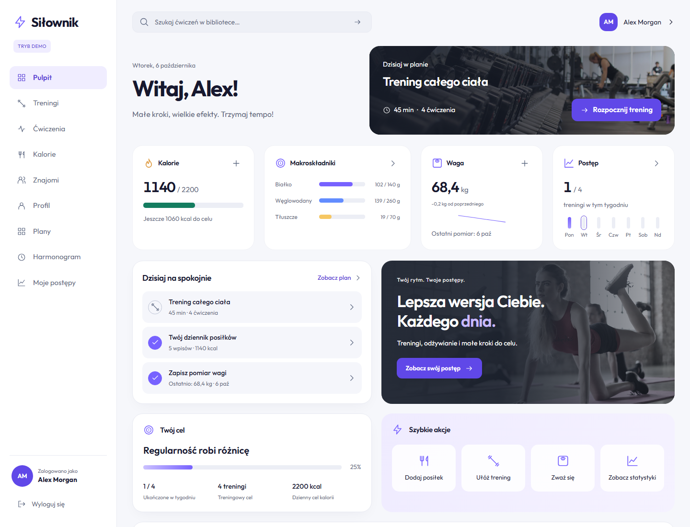
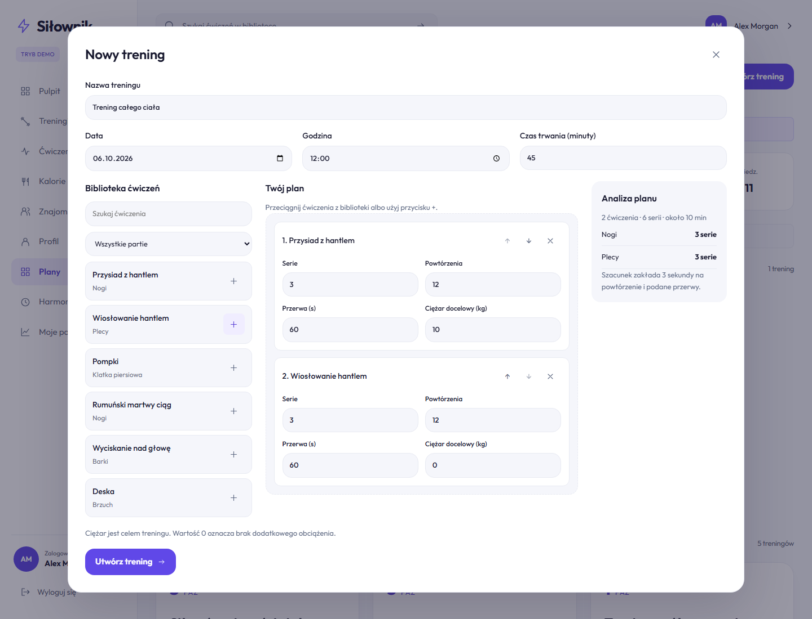
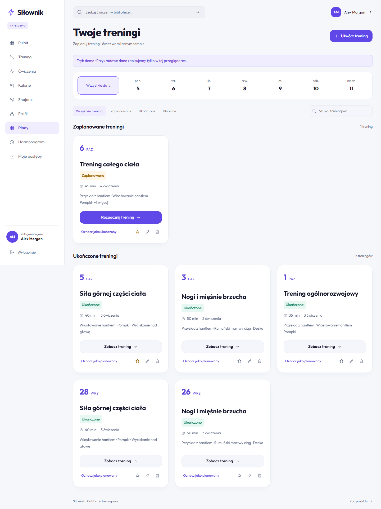
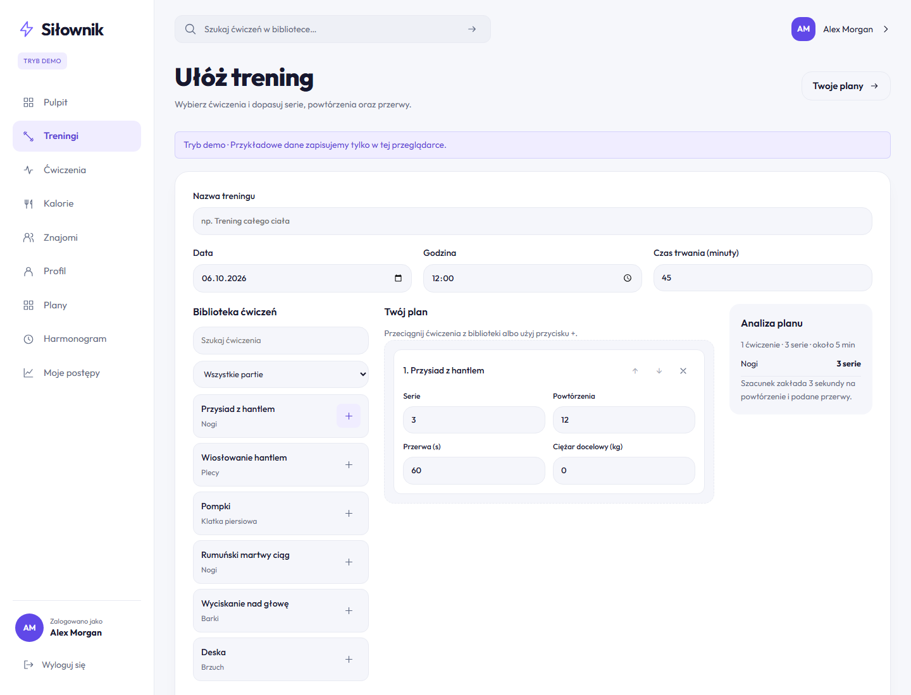
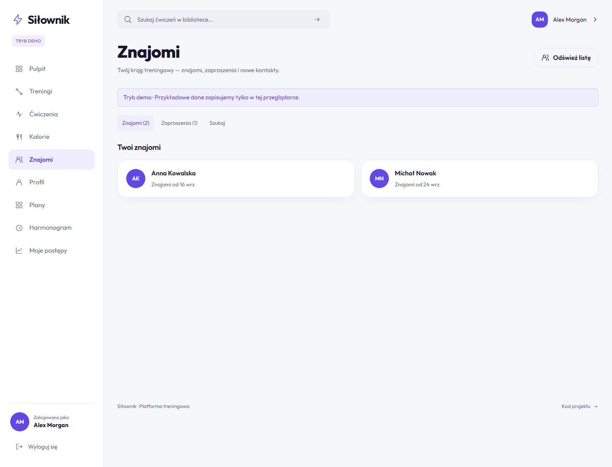
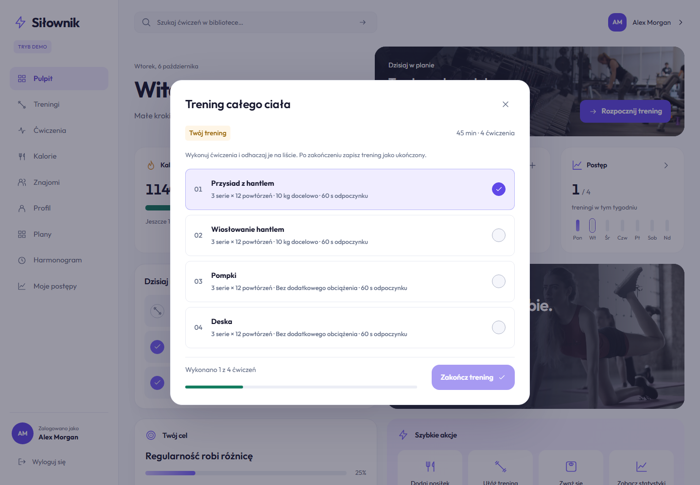
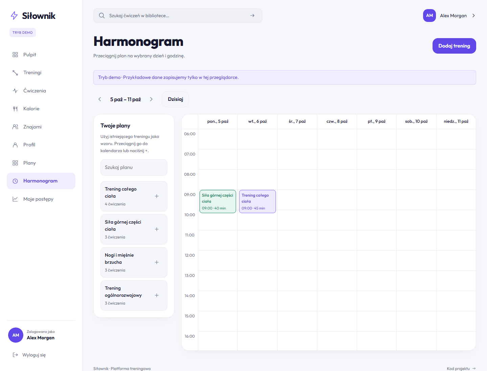
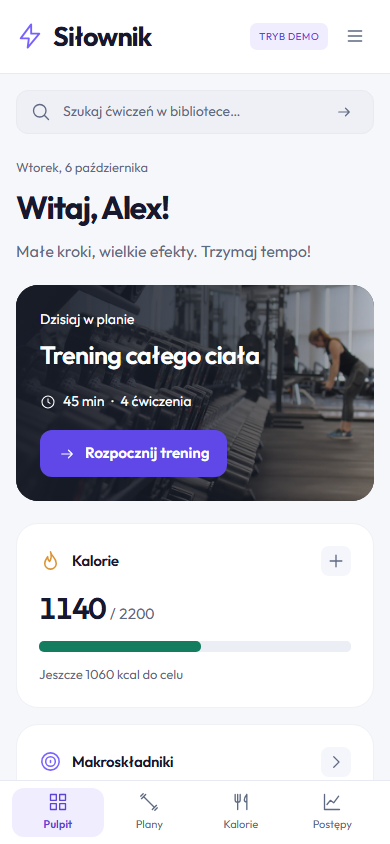

# Fitness Platform

## O projekcie

Fitness Platform, czyli **Siłownik**, służy do planowania treningów, prowadzenia dziennika żywienia i śledzenia postępów. Interfejs jest po polsku i działa na komputerze oraz telefonie. Frontend korzysta z modułów Vanilla JavaScript, a API ASP.NET Core zapisuje dane kont w SQLite.

[Otwórz demo](https://beerck7.github.io/fitness-platform-web/)

Publiczne demo działa bez backendu, na przykładowych danych zapisanych w przeglądarce. Tryb API można uruchomić lokalnie. Logowanie w demo nie tworzy rzeczywistego konta ani nie zapisuje hasła.

## Najważniejsze funkcje

- Pulpit z dzisiejszym treningiem, kaloriami, makroskładnikami, wagą i szybkimi akcjami.
- Kreator planów: biblioteka ćwiczeń, przeciąganie, kolejność, serie, powtórzenia, przerwy i docelowy ciężar.
- Harmonogram tygodniowy z przeciąganiem planu na dzień i godzinę oraz edycją zaplanowanego treningu.
- Sesja treningowa z listą ćwiczeń do odznaczania, zapisem ukończenia i ulubionymi planami.
- Dziennik żywienia z produktami, porcjami, kaloriami i makroskładnikami; przeciąganie wpisów między posiłkami.
- Pomiary masy ciała, wykresy i podsumowania aktywności w różnych zakresach czasu.
- Profil i cele użytkownika, rejestracja, logowanie oraz zmiana hasła w trybie API.
- Znajomi: wyszukiwanie publicznych profili i obsługa zaproszeń.

Przeciąganie ma odpowiedniki w przyciskach, więc plany i posiłki można edytować również na telefonie i z klawiatury. Formularze pokazują błędy przy polach, a widoki rozróżniają ładowanie, brak danych i błąd z możliwością ponowienia żądania.

Docelowy ciężar jest wartością planowaną. Podczas sesji zapisywane jest ukończenie treningu; aplikacja nie mierzy czasu wykonania ani rzeczywistych wyników poszczególnych serii.

## Technologie

- Frontend: HTML5, SCSS, BEM, Vanilla JavaScript ES modules, Fetch API i Vite.
- Backend: ASP.NET Core / .NET 10, MediatR i EF Core.
- Dane i logowanie: SQLite, JWT i BCrypt.Net.
- Sprawdzanie kodu: ESLint i Prettier.
- Testy: Node test runner, Playwright i axe-core.

## Uruchomienie

Wymagania: Node.js 24+ i npm. Tryb API wymaga dodatkowo .NET SDK 10. Tryb demo potrzebuje tylko Node.js.

### Demo

```sh
npm ci
npm run dev
```

Otwórz `http://127.0.0.1:5173`. Domyślnie włączone jest demo. Możesz ułożyć trening, wpisać posiłek, zmienić cele i sprawdzić postępy bez zakładania konta. Dane zapisują się w localStorage bieżącej przeglądarki; wyczyszczenie danych witryny przywraca stan początkowy. Nie wpisuj rzeczywistych haseł w formularzu demonstracyjnym.

W zakładce Treningi przeciągnij ćwiczenie z biblioteki lub dodaj je przyciskiem +. Ustaw serie, powtórzenia, przerwy i ciężar; 0 kg oznacza brak dodatkowego obciążenia. Zapisany trening znajdziesz w Planach i możesz przenieść go do harmonogramu. Dziennik żywienia działa podobnie: wybierz produkt, posiłek i ilość, a aplikacja przeliczy wartości odżywcze.

### Frontend z API

Utwórz `.env.local` w katalogu głównym:

```dotenv
VITE_DEMO_MODE=false
VITE_API_BASE_URL=/api
```

W drugim terminalu uruchom backend:

```sh
dotnet restore backend/Fit.Api/Fit.Api.csproj
dotnet build backend/Fit.Api/Fit.Api.csproj --configuration Release
npm run api:dev
```

API działa na `http://127.0.0.1:5080`, a Vite przekazuje do niego żądania `/api`. Po zmianie konfiguracji uruchom frontend ponownie. Wybierz **Utwórz konto**, aby się zarejestrować. Backend tworzy lokalną bazę SQLite i dodaje przykładowe ćwiczenia oraz produkty. Plik bazy nie trafia do Git.

Skrypt `api:dev` uruchamia kompilację Release w środowisku Development, dlatego po zmianach C# wykonaj build ponownie. Jeśli SDK nie jest dostępne w PATH, można wskazać plik wykonywalny przez `DOTNET_EXECUTABLE`. Publiczne demo na GitHub Pages udostępnia sam frontend, bez tego API.

### Build i testy

```sh
npm run format:check
npm run lint
npm test
npm run build
npm run preview
```

Testy jednostkowe sprawdzają klienta API, dane demo i obliczenia. Aby uruchomić testy przeglądarkowe, najpierw zbuduj backend w Release oraz frontend w trybie demo (`VITE_DEMO_MODE=true`), następnie:

```sh
npx playwright install chromium
npm run test:e2e
```

Playwright uruchamia demo na porcie 4173, API na 5080 i drugi frontend połączony z API na 5174. Zatrzymaj wcześniej serwery uruchomione ręcznie. Testy obejmują planowanie treningów, przeciąganie, dziennik żywienia, znajomych, logowanie, błędy API, responsywność i dostępność.

## Organizacja kodu

`frontend/src/js/modules/` zawiera widoki aplikacji, `api/` — klienta Fetch, serwisy i dane demo, a `utils/` — funkcje pomocnicze. Nawigacja korzysta z fragmentu adresu po `#`. Zmiana widoku anuluje oczekujące żądania przez `AbortController`. Kreator treningu jest wspólny dla zakładki Treningi i okna tworzenia planu.

SCSS jest podzielony na zmienne, podstawowe style, komponenty, układ i widoki. Układy bazowe dotyczą telefonów; zapytania `min-width` dodają kolumny i boczną nawigację. Na telefonie harmonogram pokazuje wybrany dzień, a na większym ekranie cały tydzień. Dialogi obsługują klawiaturę i widoczny fokus, a animacje uwzględniają `prefers-reduced-motion`.

Backend ma osobne projekty API, Application, Domain i Infrastructure. Kontrolery przyjmują żądania, handlery wykonują operacje, a EF Core zapisuje dane w SQLite. Przykładowe endpointy to `POST /api/Account/login`, `GET /api/Workouts` i `GET /api/FoodDiary/{date}`. Frontend korzysta z tego samego interfejsu serwisów w trybie API i demo.

Klient API obsługuje błędy sieci, puste odpowiedzi i zakończenie sesji. Błąd rzeczywistego API nie przełącza aplikacji na dane demo. Tekst wpisany przez użytkownika jest zabezpieczany przed interpretacją jako HTML. Pulpit wylicza podsumowania z zapisanych treningów, posiłków, celów i pomiarów, zamiast korzystać z osobnych statycznych liczników.

Hasła są haszowane przez BCrypt. Token JWT jest przechowywany w pamięci frontendu; odświeżenie strony wymaga ponownego logowania. API sprawdza token i dostęp do danych właściciela. Wyszukiwanie znajomych pokazuje tylko publiczne profile, a zaproszenie może zaakceptować jego odbiorca. Demo tej funkcji korzysta z przykładowych osób.

W Development backend generuje tymczasowy klucz JWT. Poza tym środowiskiem wymaga `Jwt__Key` z co najmniej 64 losowymi znakami i właściwych adresów w `Cors__Origins__0` itd. Sekretu JWT nie wolno umieszczać w publicznych zmiennych `VITE_`. `.env.example` zawiera tylko ustawienia frontendu, a lokalne sekrety, bazy i pliki wynikowe są pomijane przez Git.

## Zrzuty ekranu





<details>
<summary>Pozostałe widoki i telefon</summary>













</details>

Zdjęcia pochodzą z Unsplash: [siłownia](https://images.unsplash.com/photo-1534438327276-14e5300c3a48), [trening](https://images.unsplash.com/photo-1518611012118-696072aa579a). Są zapisane lokalnie w WebP. Font Outfit zachowuje [licencję SIL OFL](frontend/public/fonts/OFL.txt).

## Co było celem projektu

Zbudowanie aplikacji, w której można zaplanować trening i później sprawdzić postępy. Zależało mi na zachowaniu przeciągania w kreatorze i dzienniku oraz połączeniu tych samych widoków z demonstracyjnymi danymi i rzeczywistym REST API.

## Dalszy rozwój

Kolejnym krokiem jest zapis rzeczywistych wyników poszczególnych serii i czasu sesji. W części kont przyda się odzyskiwanie hasła oraz odświeżanie i unieważnianie tokenów. Obecna aplikacja nie obsługuje tych funkcji.
